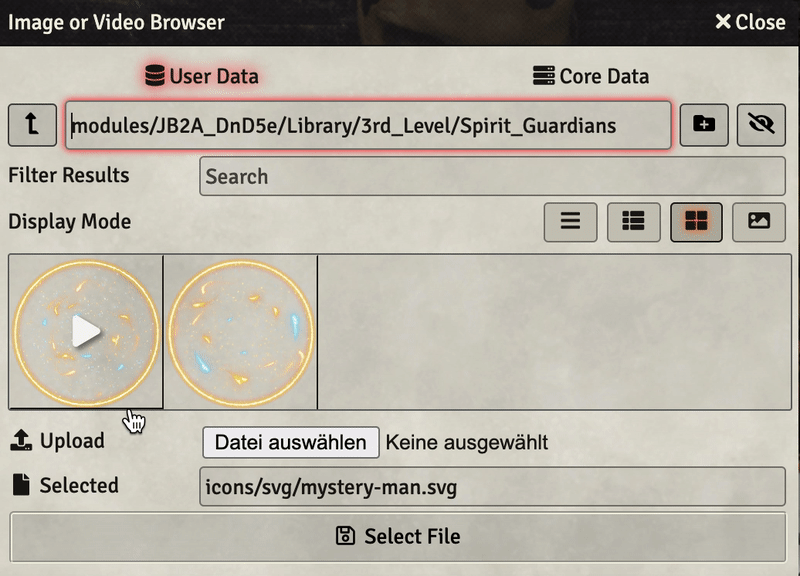

# Animation Preview
This is a simple module for [Foundry Virtual Tabletop](http://foundryvtt.com) that allows you to preview animations
(video files) in the file picker. This is especially helpful when looking for animated tokens or spell effects.

Each video file will start playing when you hover the preview image with your mouse and stop playing once your mouse
leaves the preview.

